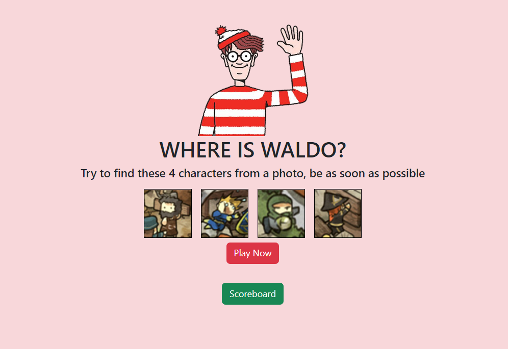

# odin-wheres-waldo (Game)
A simple game of  photo tagging app. Like Where's Waldo, user is given a large image which contains several elements to find. Lastly, user add name to leaderboard. This is an remake of my previous project with postgreSQL and prisma



## Live demo

- FE : https://wongyc-66.github.io/odin-wheres-waldo-FE-psql/
- Back end : https://odin-wheres-waldo-be-psql.adaptable.app/


## Tech-stack
- FE : react, vite, bootstrap
- BE : node.js, express, postgreSQL, prisma


## Installation (BE)
1. create .env file,  add
```
    DATABASE_URL : "\<your postgreSQL connection string\>"
```
2. npm run serverstart

## Installation (FE)
1. modify const API_URL = "< your backend root URL>", at /src/api_url.js, 
2. npm run dev

## Source

- Front end :  https://github.com/WongYC-66/odin-wheres-waldo-FE-psql
- Back end : https://github.com/WongYC-66/odin-wheres-waldo-BE-psql

#
BE APIs :
1.  /v1/success_guess_post 
    - input : val, x-coor, y-coor
    - output : true/ false

2.  /v1/score_board_get
    - output : [{username1, score1}, ...]

3.  /v1/score_board_post
    - input : user, time
    - output : success/submission failed
